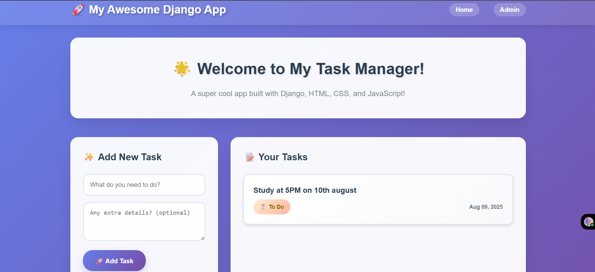
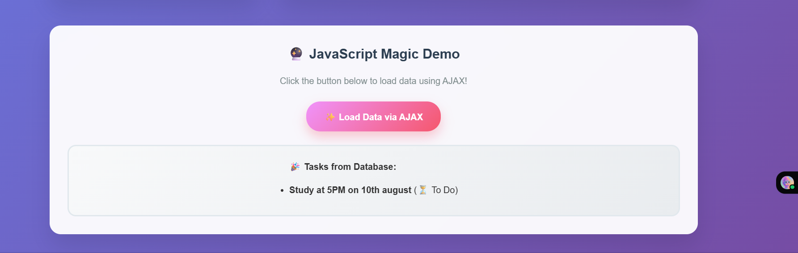

**🚀 Django Task Manager**

A modern, interactive task management web application built with Django, featuring a beautiful gradient UI, AJAX functionality, and smooth animations.

**✨ Features**

- **Create Tasks**: Add new tasks with titles and optional descriptions
- **Task Management**: View all your tasks in an organized, card-based layout
- **Interactive UI**: Smooth animations, hover effects, and sparkle animations
- **AJAX Integration**: Add tasks without page refresh using modern JavaScript
- **Responsive Design**: Works perfectly on desktop and mobile devices
- **Admin Panel**: Full Django admin integration for backend management
- **Modern Styling**: Beautiful gradient backgrounds and glassmorphism effects

**🛠️ Technology Stack**

- **Backend**: Django 5.2.5
- **Database**: SQLite3 (development)
- **Frontend**: HTML5, CSS3, JavaScript (ES6+)
- **Styling**: Custom CSS with gradients and animations
- **Architecture**: MVT (Model-View-Template) pattern

**📋 Requirements**

- Python 3.8+
- Django 5.2.5
- SQLite3 (included with Python)

**🚀 Quick Start**

**1\. Clone the Repository**

git clone <https://github.com/shishiryadev/task-manager.git>

cd task-manager

**2\. Create Virtual Environment**

\# Windows

python -m venv venv

venv\\Scripts\\activate

\# macOS/Linux

python3 -m venv

source venv/bin/activate

**3\. Install Dependencies**

pip install django==5.2.5

**4\. Set Up Database**

python manage.py migrate

**5\. Create Superuser (Optional)**

python manage.py createsuperuser

**6\. Run Development Server**

python manage.py runserver

Visit <http://127.0.0.1:8000> to see your app in action! 🎉

**📁 Project Structure**

myproject/

├── manage.py # Django management script  
├── db.sqlite3 # SQLite database  
├── myproject/ # Main project directory  
│ ├── \__init_\_.py  
│ ├── settings.py # Django settings  
│ ├── urls.py # Main URL configuration
│ ├── wsgi.py # WSGI application
│ └── asgi.py # ASGI application
├── myapp/ # Task management app
│ ├── \__init_\_.py
│ ├── models.py # Task model definition
│ ├── views.py # View functions & API endpoints
│ ├── urls.py # App URL patterns
│ ├── admin.py # Admin configuration
│ ├── apps.py # App configuration
│ ├── tests.py # Test cases
│ └── migrations/ # Database migrations
│ ├── \__init_\_.py
│ └── 0001_initial.py # Initial Task model migration
├── templates/ # HTML templates
│ └── myapp/
│ ├── base.html # Base template with header/footer
│ └── index.html # Home page with task interface
└── static/ # Static files
└── myapp/
├── css/
│ └── style.css # Modern gradient styles & animations
└── js/
└── script.js # Interactive features & AJAX

**🎨 Key Features Explained**

**Task Model (myapp/models.py)**

The app includes a custom Task model with:

- **Title**: CharField(max_length=200) - Required task name
- **Description**: TextField(blank=True) - Optional task details
- **Completed**: BooleanField(default=False) - Task completion status
- **Created_at**: DateTimeField(auto_now_add=True) - Automatic timestamp
- **String representation**: Returns task title
- **Meta configuration**: Properly configured app_label

**API Endpoints (myapp/views.py)**

- **GET /**: Home page rendering all tasks from database
- **GET /api/data/**: JSON API returning all tasks data
- **POST /api/data/**: AJAX endpoint for creating new tasks
- **CSRF exempt**: Configured for seamless AJAX requests

**Interactive Frontend Features**

- **Dynamic Task Addition**: Add tasks via AJAX without page refresh
- **Real-time DOM Updates**: New tasks appear instantly with animations
- **Smooth Animations**: CSS transitions and JavaScript-powered effects
- **Sparkle Effects**: Magical sparkle animations on button clicks
- **Editable Tasks**: Double-click task titles to edit them inline
- **Loading States**: Visual feedback during AJAX operations
- **Error Handling**: User-friendly error messages and validation
- **Intersection Observer**: Elements animate in when scrolled into view

**Modern UI Design**

- **Glassmorphism**: Translucent elements with backdrop blur effects
- **Gradient Backgrounds**: Purple-blue gradient theme throughout
- **Card-based Layout**: Clean, organized task display with shadows
- **Hover Effects**: Interactive elements that lift and glow on hover
- **Responsive Grid**: Two-column layout that adapts to mobile
- **Status Indicators**: Visual badges for task completion status

**🔧 Development**

**Adding New Features**

1. **Models**: Modify myapp/models.py to add new fields or models
2. **Views**: Update myapp/views.py for new functionality and API endpoints
3. **URLs**: Add URL patterns in myapp/urls.py
4. **Templates**: Update templates in templates/myapp/
5. **Styling**: Add CSS in static/myapp/css/style.css
6. **JavaScript**: Add interactivity in static/myapp/js/script.js
7. **Admin**: Register models in myapp/admin.py for admin interface

**Database Migrations**

After modifying models, always create and apply migrations:

python manage.py makemigrations myapp

python manage.py migrate

**Run Tests**

python manage.py test myapp

**Collect Static Files (Production)**

python manage.py collectstatic

**🌐 API Endpoints**

- **GET /** - Home page with task list and interactive form
- **GET /admin/** - Django admin panel for backend management
- **GET /api/data/** - JSON API returning all tasks from database
- **POST /api/data/** - Create new task via AJAX (expects JSON: {title, description})

**API Response Format**

{

"tasks": \[

{

"id": 1,

"title": "Study at 5PM on 10th august",

"description": "",

"completed": false,

"created_at": "2025-08-09T06:04:10.676Z"

}

\]

}

**📱 Screenshots**

  

**🚀 Deployment**

**For Production:**

1. Set DEBUG = False in settings.py
2. Configure ALLOWED_HOSTS
3. Use a production database (PostgreSQL recommended)
4. Set up a proper web server (Nginx + Gunicorn)
5. Configure static files serving
6. Use environment variables for sensitive settings

**Environment Variables (Recommended):**

SECRET_KEY=your-secret-key-here

DEBUG=False

DATABASE_URL=your-database-url
